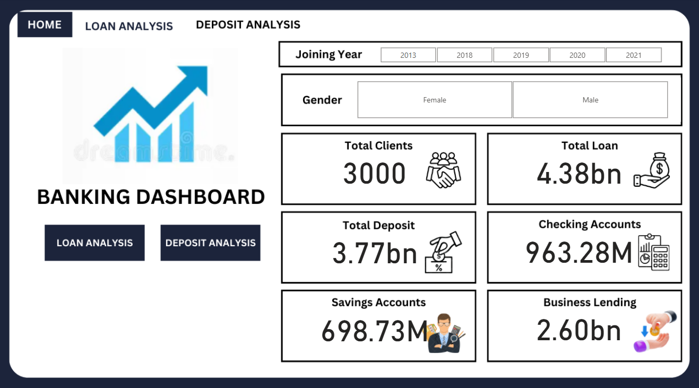
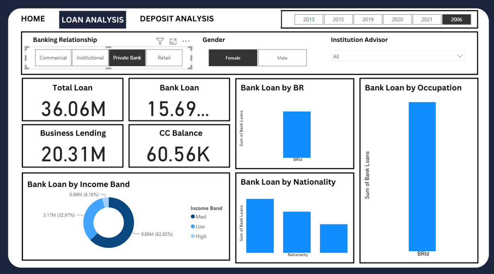
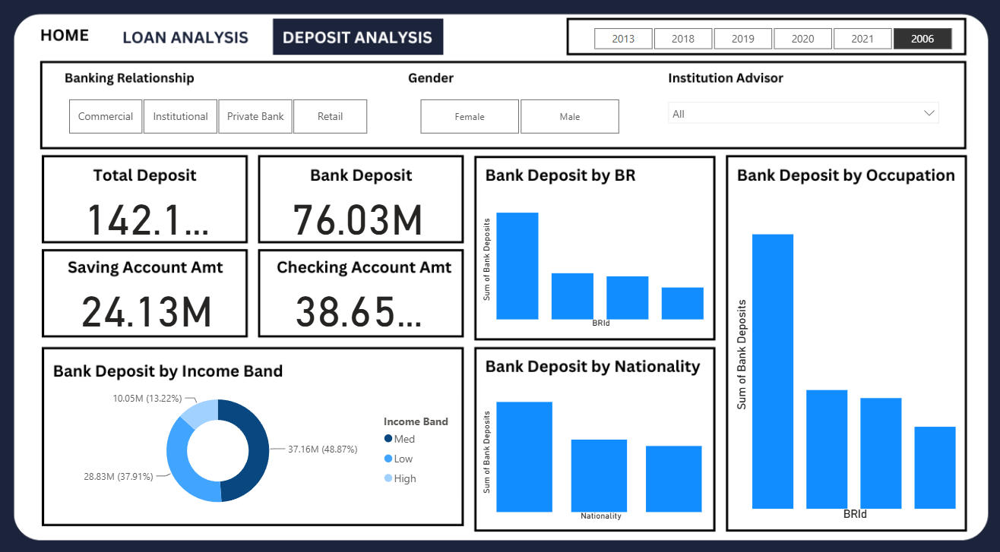

# Banking Analysis Dashboard

## 📌 Project Overview

This project presents an end-to-end Banking Analysis solution developed using **Python, SQL, and Power BI**. The objective is to analyze banking customer data, identify financial trends, and create an interactive dashboard that provides meaningful business insights.

The project includes Exploratory Data Analysis (EDA) performed in Google Colab, followed by an interactive Power BI dashboard with multiple report pages.

---

## 🎯 Business Objective

Banks collect large amounts of customer and financial data. This project aims to transform that data into actionable insights by analyzing customer demographics, deposits, loans, and banking relationships.

The project focuses on:

- Customer segmentation
- Loan analysis
- Deposit analysis
- Banking relationship analysis
- Financial KPI tracking
- Interactive business reporting

---

## 🛠️ Tools & Technologies

- Python
- Pandas
- SQL
- Matplotlib
- Google Colab
- Power BI
- GitHub

---

## 📂 Dataset

The dataset contains banking customer information including:

- Customer demographics
- Banking relationship type
- Deposits
- Loans
- Savings accounts
- Checking accounts
- Business lending
- Income bands
- Nationality
- Occupation

Dataset File:

`data/Banking.xlsx`

---

## 📊 Exploratory Data Analysis (EDA)

EDA was performed using Python and SQL in Google Colab.

The analysis included:

- Data Cleaning
- Missing Value Analysis
- Summary Statistics
- Customer Distribution Analysis
- Deposit Analysis
- Loan Analysis
- Income Band Analysis
- Correlation Analysis
- Data Visualization

Notebook:

`notebooks/Banking_risk_analysis_EDA.ipynb`

---

## 📈 Power BI Dashboard

An interactive Power BI dashboard was developed to visualize banking performance across multiple pages.

### Dashboard Features

### 🏠 Home Dashboard

- Total Clients
- Total Loans
- Total Deposits
- Savings Accounts
- Checking Accounts
- Business Lending

### 💰 Loan Analysis

- Total Loan
- Bank Loan
- Business Lending
- Credit Card Balance
- Loan by Banking Relationship
- Loan by Occupation
- Loan by Income Band
- Loan by Nationality

### 🏦 Deposit Analysis

- Total Deposit
- Bank Deposit
- Savings Account Amount
- Checking Account Amount
- Deposit by Banking Relationship
- Deposit by Occupation
- Deposit by Income Band
- Deposit by Nationality

Power BI File:

`powerbi/Banking analysis dashboard.pbix`

---

# Dashboard Preview

## Home Dashboard



---

## Loan Analysis Dashboard



---

## Deposit Analysis Dashboard



---

## 📈 Exploratory Data Analysis

Example EDA visualizations are included in the notebook demonstrating:

- Distribution Analysis
- Correlation Analysis
- Customer Segmentation
- Loan Distribution
- Deposit Distribution

---

## 📁 Project Structure

```text
banking-analysis-dashboard
│
├── data
│   └── Banking.xlsx
│
├── notebooks
│   └── Banking_risk_analysis_EDA.ipynb
│
├── powerbi
│   └── Banking analysis dashboard.pbix
│
├── screenshots
│   ├── dashboard_overview.png
│   ├── loan_analysis.png
│   ├── deposit_analysis.png
│   └── (EDA charts)
│
└── README.md
```

---

## 💡 Key Insights

- Analyzed banking customer demographics and financial products.
- Compared loan and deposit distributions across different customer segments.
- Built interactive Power BI dashboards with filters for year, gender, banking relationship, and institution advisor.
- Identified trends in deposits, loans, income bands, and customer categories through exploratory data analysis.

---

## 🚀 Skills Demonstrated

- Data Cleaning
- SQL Queries
- Exploratory Data Analysis (EDA)
- Data Visualization
- Power BI Dashboard Development
- KPI Reporting
- Business Intelligence
- Data Storytelling

---

## 👨‍💻 Author

**Akash S P**

Data Analytics Portfolio
